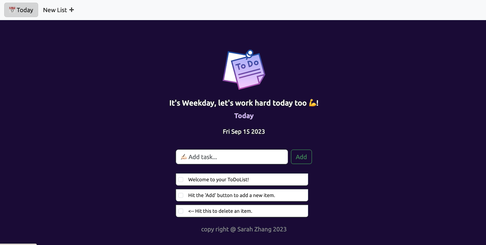

# To-Do List App

A simple web-based To-Do List application built using Express.js and MongoDB with Mongoose.

# Live demo
[Simple Todo list](https://to-do-list-sarahrosario.onrender.com)


## Table of Contents
- [Features](#features)
- [Prerequisites](#prerequisites)
- [Installation](#installation)
- [Usage](#usage)
- [Contributing](#contributing)
- [License](#license)

## Features

- Create, read, and delete tasks/lists.
- Mark tasks as completed.
- MongoDB integration with Mongoose for data storage.
- Simple and intuitive web interface.

## Prerequisites

Before you begin, ensure you have met the following requirements:

- Node.js and npm installed on your machine.
- MongoDB installed and running locally or on a remote server.
- A code editor such as Visual Studio Code for development.

## Installation

1. Clone the repository:
```sh
$ git clone https://github.com/sarahrosario/to-do-list.git
```
2. Navigate into the repository's directory:
```sh
$ cd to-do-list
```
3. Install dependencies:
```sh
$ npm install
```
4. Run the server:
```sh
$ node index.js
```

## Usage
Open a web browser and navigate to http://localhost:3000 (or the port you configured).
You'll be taken to the To-Do List dashboard.
Use the interface to add, update, or delete tasks.
Mark tasks as completed.

## Contributing
Contributions are welcome! If you'd like to contribute to this project, please follow these steps:

Fork the repository.
Create a new branch: git checkout -b feature/new-feature.
Make your changes and commit them: git commit -m 'Add new feature'.
Push to the branch: git push origin feature/new-feature.
Submit a pull request.
Please read our contributing guidelines for more details.

## License
This project is licensed under the MIT License - see the LICENSE file for details.


